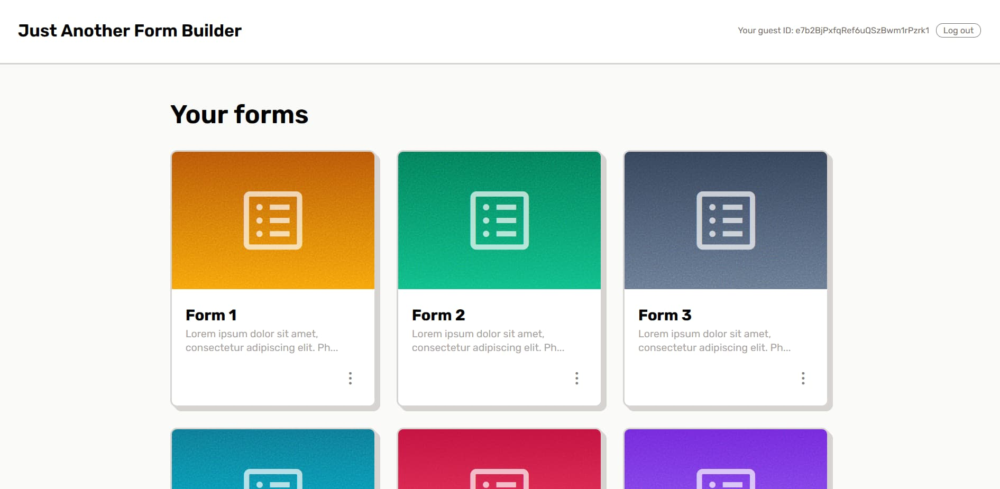
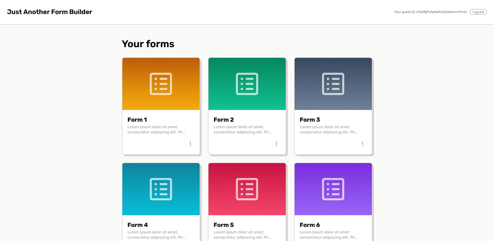
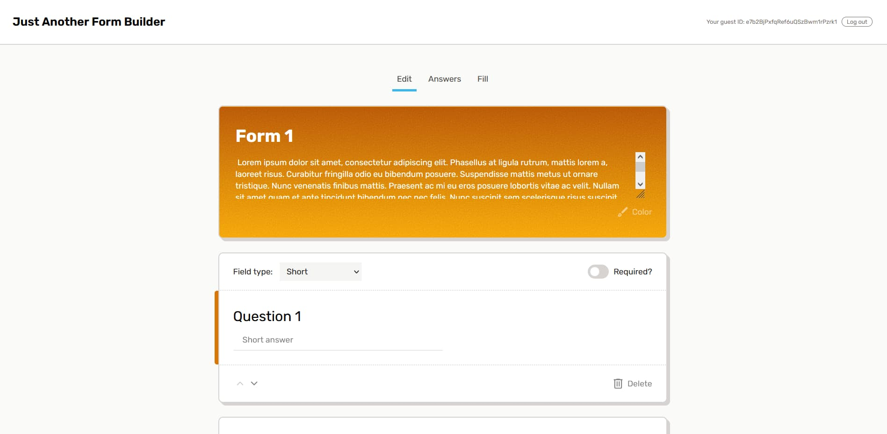
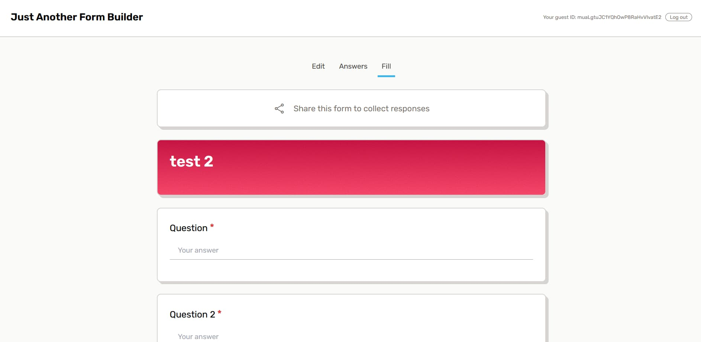
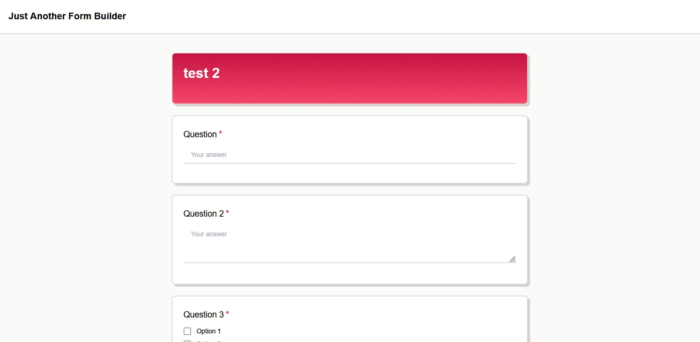
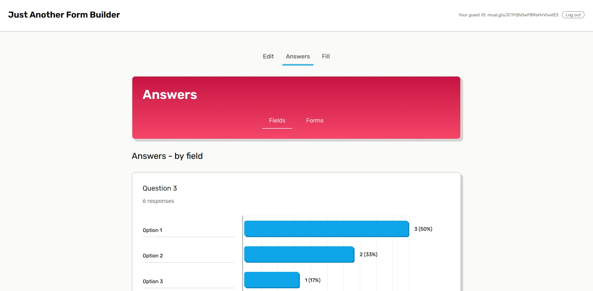
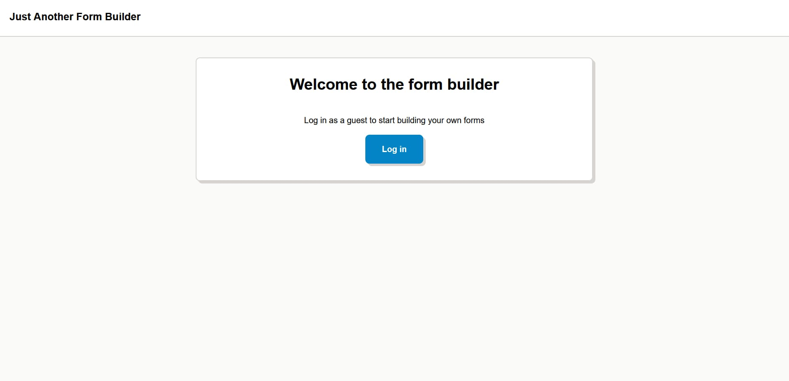
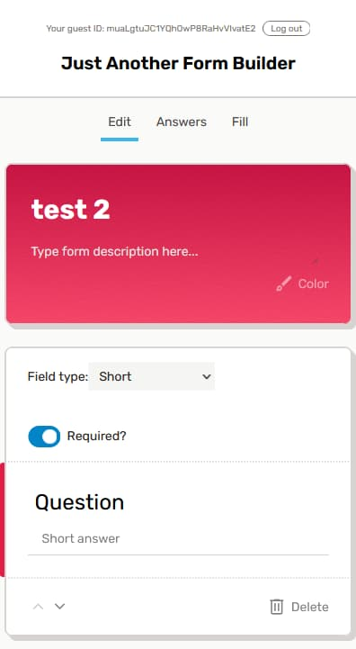
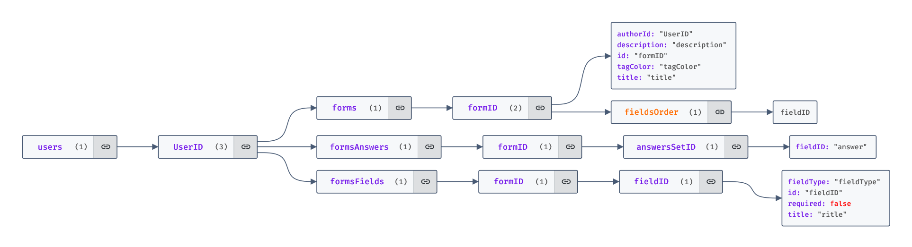
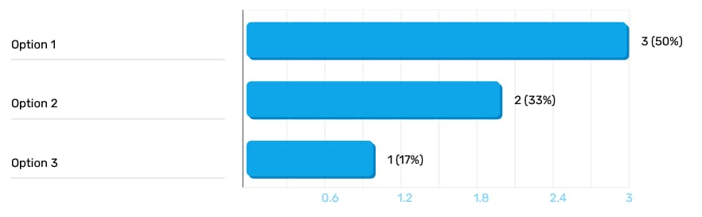

# Just Another Form Builder

Create online forms with multiple question types in this form editor inspired by [Google Forms](https://www.google.com/forms/about/). Edit surveys, collect responses and analyze results.

[See the app live.](https://just-another-form-builder.netlify.app/)

## Table of Contents

- [Just Another Form Builder](#just-another-form-builder)
  - [Table of Contents](#table-of-contents)
  - [General Info](#general-info)
  - [Setup](#setup)
  - [Features](#features)
  - [Design](#design)
    - [Selected views](#selected-views)
    - [Graphic elements](#graphic-elements)
  - [Technologies](#technologies)
  - [Challenges and solutions](#challenges-and-solutions)
    - [Data structure](#data-structure)
    - [Styling](#styling)
    - [Routing and authentication](#routing-and-authentication)
    - [Static typing](#static-typing)
    - [SVG generating for data presentation](#svg-generating-for-data-presentation)
    - [Rendering component based on computed name](#rendering-component-based-on-computed-name)
    - [Generating noise texture](#generating-noise-texture)
  - [Possible improvements](#possible-improvements)
  - [Acknowledgements](#acknowledgements)
    - [Useful resources](#useful-resources)
    - [Assets](#assets)
  - [Contact](#contact)

## General Info

Just Another Form Builder is a SPA application developed to practice TypeScript and learn managing basic data structures. The application allows you to build your own forms, collect answers and display organized results. The application is inspired by Google's form editor, which helped answer challenges related to functionality and user experience design. Database and authentication service is hosted on Firebase.

> **_NOTE:_** The app provides anonymous authentication by default. Changes made by the user are available during a session authenticated with a unique identifier. The identifier is associated with the IP address of the user's device. Once logged out, there is no way to return to the same anonymous account.

## Setup

The project uses [Node](https://nodejs.org/en/) and [NPM](https://www.npmjs.com/). To run the app on your machine you should install all dependencies. Then create a developer build on a localhost port and run your web explorer.

Clone repository

```
git clone https://github.com/M-Mikos/just-another-form-builder.git
```

Install dependencies

```
npm i
```

Go live with developer build

```
npm run dev
```

Just Another Form Builder is ready at port 5173.

```
localhost:5173/
```

## Features

- Create new form with title and optional description
- Edit or delete form
- Change form theme color
- Build form from 5 types of question fields:
  - Short answer
  - Paragraph answer
  - Single choice
  - Multiple choice
  - Licear scale
- Add multiple options to choice fields
- Add "another option" field to choice fields
- Cofigure min and max value on linear scale, set number of steps
- Set field question
- Mark field as required or optional
- Change fields order
- Delete field
- Fill form (forms to fill out are public, so everyone with a link can submit answer to it)
- View form answers sorted by field type
- View form answers sorted by form
- Display thank you page after form submission
- Anonymous authentication system to protect form editing and form asnwers

## Design

The application comes with simple, clear styles designed to clearly present functionality. The application was created using the principles of Responsive Web Design, with a mobile-first approach.

The application uses colors from the default color palettes of the Tailwind CSS framework. A special design element is the addition of a programmatically generated noise texture to the selected backgrounds.

### Selected views

| Home page view                                                               | Form editor view                                                                 |
| ---------------------------------------------------------------------------- | -------------------------------------------------------------------------------- |
|  |  |

| Form fill page view (authorized user)                                             | Form fill page view (unauthorized user)                                               |
| --------------------------------------------------------------------------------- | ------------------------------------------------------------------------------------- |
|  |  |

| Answers page view                                            | Login page view                                          | Form edit page mobile view                                                     |
| ------------------------------------------------------------ | -------------------------------------------------------- | ------------------------------------------------------------------------------ |
|  |  |  |

### Graphic elements

Project includes icons from [Remix Icon](https://remixicon.com/) library. All other UI elements are self-styled.

## Technologies

The technologies used in the Just another Form Builder application are listed below. For more detailed solutions description check next section and comments in application files.

- [Vite](https://vitejs.dev/) - Setting up dev environment
- [TypeScript](https://www.typescriptlang.org/)
- [React.js](https://react.dev/)
- [React Router](https://reactrouter.com/en/main) - Page routing and preloading data
- [Tailwind](https://tailwindcss.com/)
- [Firebase Realtime Database]() - NoSQL database
- [Firebase Authentication]() - Solution for anonymous (guest) authentication

## Challenges and solutions

During the development of the project, 'Just another form builder' turned out to be quite a complex application, which resulted in various technical challenges, even reaching the scope of backend issues. Although not all solutions may be optimal in terms of performance and quality, I consider them sufficient for educational purposes.

### Data structure

Application data is stored in a NoSQL Firebawse database, in JSON format. Data is assigned to specific users. To minimize request size and protect response data from unauthorized access, the data structure is kept as flat as possible.


_Data structure of user node in database_

In order to display the list of forms, only data from the `form` entry is requested; in order to edit and present the form, field details data from the `formFields` entry are additionally sent. Data from the `formAnswers` entry is only sent to the protected answers route.

Data specific to application instances is stored in React Context (authentication data) or as the state of individual components.

### Styling

The Tailwind CSS framework was used to build application styles. Tailwind introduces utility classes that were widely used in the project. Additionally, the project makes use of more advanced features of the framework, such as components and utilities layers, `group-` and `peer-` modyfiers, as well as specifying custom theme elements.

### Routing and authentication

The application uses the React Router library to manage the display of individual paths. Paths use loader functions to load content early. Loaders are called again each time an action is dispatched from the action function assigned to each path.

Access to protected paths is enforced by the `<Protected/>` component. If the `user` object is empty, the component redirects the user to the login page. If the loader function is called before the user is authenticated, the component reloads the page after successful authentication.

The component code:

```javascript
const Protected = (props: PropsTypes): JSX.Element => {
  const data = useLoaderData();
  const navigate = useNavigate();
  const [loading, setLoading] = useState(true);

  useEffect(() => {
    const unsubscribe = auth.onAuthStateChanged((user) => {
      if (!user) {
        // User is not authenticated, redirect to login
        navigate("/login");
      }

      // Re-call loader function when user is authenticated, but loader returned no user
      if (user && data === "no user") {
        navigate(".", { replace: true });
      }
      // Set loading to false after the authentication state is resolved
      setLoading(false);
    });

    // Cleanup function
    return () => {
      unsubscribe();
    };
  }, []);

  return <>{loading ? <LoadingIndicator /> : props.children}</>;
};

export default Protected;
```

Additional blocking of access to protected resources is done by defining the response rules inside the Firebase console.

### Static typing

The project uses TypeScript to provide safe typing and make it easier to write and maintain error-tolerant code. Global type interfaces are stored in the `types.ts` file. Components also have locally defined interfaces for props.

The idea was to minimize the use of the `any` type, which fundamentally denies the point of using the TypeScript language. The only exception is the definition of the type of authentication object "user", which is not provided with the Firebase library.

### SVG generating for data presentation

In case of repeated answers to a form question, the `<AnswersSetDisplay>` component generates a horizontal bar chart as an SVG graphic. The component calculates the percentage of each answer in the total number of answers and generates an appropriate entry on the chart along with a tip visible on hover.


_Example SVG bar chard generated in apllication_

### Rendering component based on computed name

To enable dynamic generation of forms for editing or filling out, form field components are automatically selected depending on the field type and its purpose (editing or displaying). For example, to display a short answer field in edit mode, you must render the `<ShortEditElement>` component. This functionality is contained in the `renderReactComponentByName` helper function, which takes as an argument an object with a name-constructor pair in each entry.

The function creates a properly formatted component name, selects the appropriate component constructor, and returns the component created with the selected constructor.

The function code is presented below:

```javascript
const renderReactComponentByName = (
  fieldType: string,
  mode: "Edit" | "Fill",
  components: { [key: string]: React.ComponentType<any> },
  componentProps: { [key: string]: any } = {}
) => {
  // Create properly formatted component name
  const formattedFieldName: string = fieldType + mode + "Element";

  // Select component constructor based on form field type
  const FieldComponent: React.ComponentType = components[formattedFieldName];

  // Rendering function for proper types of dynamically choosen react component.
  const renderFieldComponent = (
    FieldComponent: React.ComponentType
  ): JSX.Element => {
    return <FieldComponent {...componentProps} />;
  };

  return renderFieldComponent(FieldComponent);
};

export default renderReactComponentByName;
```

### Generating noise texture

An element of the application's design is a noise texture added to the background areas. The texture is generated inside the `<NoiseTexture>` component as an SVG element. For this purpose, the `filter` tag was used.

The code generating the appropriate SVG element is presented below:

```javascript
<svg
  id="turbulence"
  className={
    "absolute left-0 top-0 h-full w-full opacity-50 mix-blend-overlay " +
    props.className
  }
>
  <filter id="noise">
    <feTurbulence
      type="fractalNoise"
      numOctaves="2"
      baseFrequency=".6"
      stitchTiles="stitch"
    ></feTurbulence>
  </filter>
  <rect width="100%" height="100%" filter="url(#noise)"></rect>
</svg>
```

## Possible improvements

- application refactor
- add sign up by email functionality
- improve application performance
- add more filed types
- add actions and loaders error handling visible on UI
- storing current form state in state manager (context, redux) and updating database under the hood for smoother user expirience

## Acknowledgements

### Useful resources

- _React - The Complete Guide 2023 (incl. React Router & Redux)_ - by Maximilian Schwarzmüller
- [TypeScript Documentation](https://www.typescriptlang.org/docs/)
- [Tailwind Documentation](https://tailwindcss.com/docs/installation)
- [Firebase Documentation](https://firebase.google.com/docs)

### Assets

- [Remix Icon](https://remixicon.com/)

## Contact

Design & code by [Marcin Mikos](mailto:mikos.marcin.m@gmail.com) - feel free to contact me!

```

```
